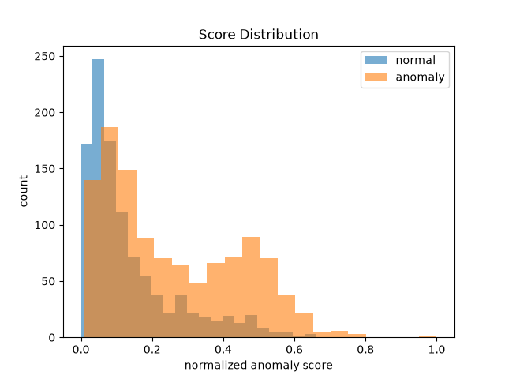
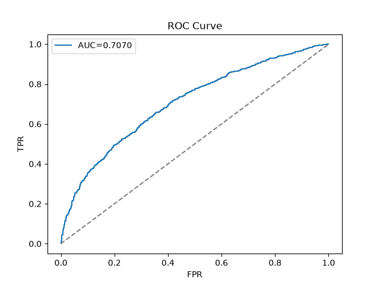
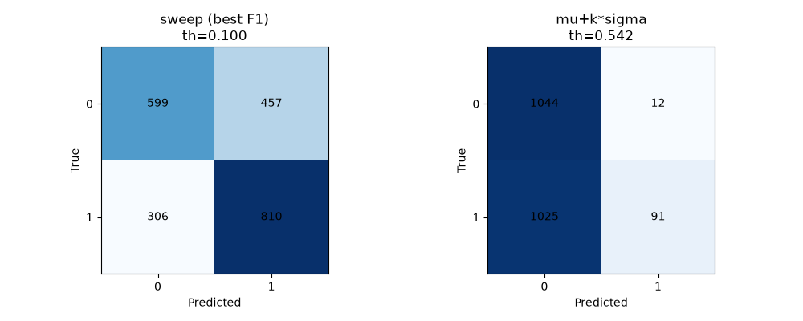
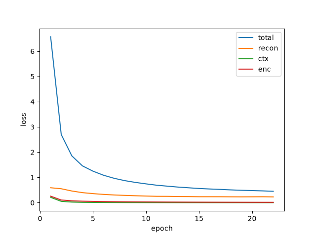
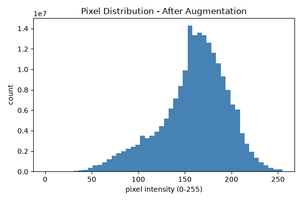
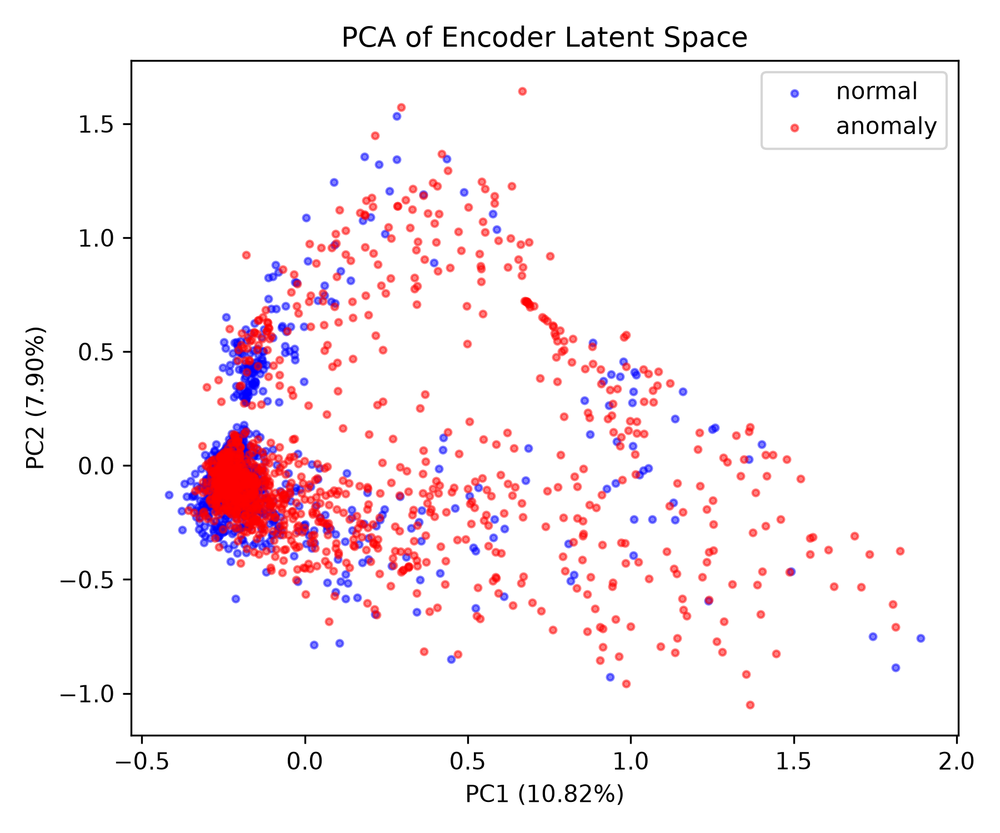
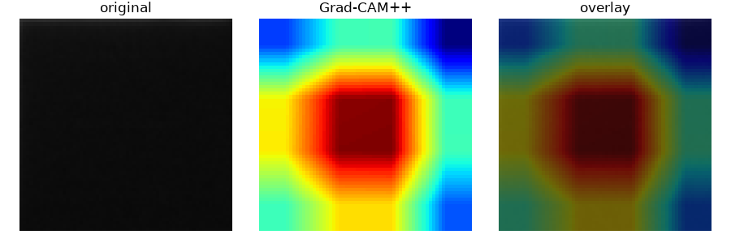

# MI-GANomaly: 태양광 패널 이상탐지

## Overview

MI-GANomaly는 태양광 패널 EL(Electroluminescence) 이미지의 결함을 정상 데이터만으로 학습해 탐지하는 Semi-Supervised Anomaly Detection 모델이다. GANomaly 구조에 MAE 스타일 랜덤 마스킹과 재설계된 복합 Loss(MSE + SSIM + Contextual + Encoder)를 결합해, 정상 분포만 학습한 인코더-디코더가 복원 오차와 latent 거리를 통해 구조적 결함을 식별하도록 설계했다.

학습 단계에서는 정상(normal) 이미지만 사용해 Encoder-Decoder-Encoder + Discriminator를 정상 분포를 복원하도록 훈련하고, 평가 단계에서는 복원 오차/latent 거리 기반 anomaly score로 정상/결함 셀을 구분한다 — 결함 라벨이 전혀 필요 없는 구조다.

## Key Results

| 단계 | AUC | F1 |
|------|-----|----|
| 베이스라인 GANomaly | 0.5096 | 0.3599 |
| + MAE 마스킹 | 0.6575 | - |
| + SSIM Loss | 0.6230 | 0.5776 |
| + 증강/안정화 | 0.6796 | - |
| + Optuna 최적화 | 0.7070 | 0.6798 |

> 상세 수치, threshold 비교(sweep vs μ+kσ), Phase별 ablation은 [`mi_ganomaly/experiments_log.md`](mi_ganomaly/experiments_log.md) 참고.





## Architecture

- **베이스**: GANomaly (Encoder–Decoder–Encoder + Discriminator)
- **마스킹**: MAE 스타일 랜덤 패치 마스킹 (단일/다중 스케일 실험)
- **Loss 재설계**: `MSE + SSIM`(재구성) + `Contextual`(Discriminator feature L1) + `Encoder`(latent MSE)
- **학습 안정화**: GroupNorm, Dropout, Weight Decay, CosineAnnealingLR, Gradient Clipping, Early Stopping

## Experiments

- **Dataset**: ELPV — 정상 이미지를 도메인 특화 증강으로 452 → 2,712장 확보(train), 결함 1,116장 / 정상 1,056장(test, 원본 그대로)
- **증강 전략**: 채택/금지 기법을 도메인 근거(패널 격자 구조, 결함 판단 기준)로 명시 — `mi_ganomaly/utils/augmentation.py`
- **Loss Ablation Study**: MSE only → +SSIM → +Contextual → +Encoder 단계별 비교
- **Bayesian Optimization**: Optuna (TPE Sampler, MedianPruner, n_trials=20) — `w_ctx`, `w_enc`, `recon_alpha`, `lr`, `mask_ratio` 탐색
- **실험 모니터링**: WandB (`MI-GANomaly`, `MI-GANomaly-optuna`, `MI-GANomaly-masking` 프로젝트)
- **시각화**: Grad-CAM++, PCA/t-SNE latent space, 공분산 행렬, Silhouette Score

### WandB 실험 대시보드
- [MI-GANomaly](https://wandb.ai/kimduyeon/MI-GANomaly) — Loss Ablation 전체 실험 (12 runs)
- [MI-GANomaly-optuna](https://wandb.ai/kimduyeon/MI-GANomaly-optuna) — Bayesian 최적화 20 trials
- [MI-GANomaly-masking](https://wandb.ai/kimduyeon/MI-GANomaly-masking) — Multi-scale 마스킹 실험 (6 runs)




## Key Findings

1. **마스킹 없이는 Contextual Loss가 0으로 수렴** — 정상 이미지만 학습 시 `feat_real ≈ feat_fake`가 되어 마스킹이 Contextual Loss 활성화의 필수 조건임을 실험적으로 확인
2. **AUC vs F1 트레이드오프 발견** — Loss 구성별 비교에서 AUC는 MSE-only가 가장 높았지만 F1/Recall은 완성형(MSE+SSIM+Ctx+Enc)이 가장 높아, 단일 지표만으로는 모델을 평가할 수 없음을 확인
3. **Multi-scale 마스킹 가설 기각** — 여러 patch 크기를 동시에 적용([8,16], [8,32], [8,16,32])해도 단일 스케일(mask_size=8)보다 낮은 AUC를 보여, 복잡도 증가가 항상 성능 향상으로 이어지지 않음을 확인
4. **Grad-CAM++의 구조적 한계** — Encoder가 isize와 무관하게 항상 4×4로 다운샘플되는 구조라, isize=32→64로 올려도 CAM 공간 해상도가 개선되지 않음을 발견 — 위치 기반 설명력보다 score 분리력에 의존하는 모델 특성으로 해석




## Environment

- Python 3.13, PyTorch 2.11 (cu128), CUDA 12.8
- GPU: NVIDIA RTX 3070
- 주요 의존성: `torchvision`, `pytorch-msssim`, `scikit-learn`, `optuna`, `wandb` (`requirements.txt` 참고)

## Project Structure

```
mi_ganomaly/
├── data/
│   ├── train/normal/             # 원본 정상 (452장)
│   ├── train/normal_augmented/   # 증강된 정상 (2,712장)
│   ├── train_augmented/          # train/normal_augmented + test 정션 결합 dataroot
│   └── test/normal/, anomaly/    # 평가용 원본 (1,056 / 1,116장)
├── models/
│   ├── ganomaly.py     # GANomaly 조립 (E1+G+E2+D)
│   ├── networks.py     # Encoder/Decoder/Discriminator (GroupNorm/Dropout)
│   └── loss.py         # ReconLoss(MSE+SSIM), ContextualLoss, EncoderLoss, TotalLoss
├── utils/
│   ├── dataloader.py       # ELPV 데이터 로드 + 증강 transform
│   ├── augmentation.py     # 오프라인 증강 파이프라인 (채택/금지 기법)
│   ├── masking.py           # MAE 스타일 랜덤 패치 마스킹
│   ├── gradcam.py           # Grad-CAM++
│   ├── visualize.py         # 시각화 유틸 (heatmap overlay 등)
│   ├── metrics.py
│   └── reproducibility.py   # set_seed
├── experiments/
│   ├── ablation_masking.py     # 마스킹 크기/비율 ablation
│   ├── optuna_search.py        # Optuna 베이지안 탐색
│   ├── multiscale_masking.py   # Multi-scale 마스킹 실험
│   ├── gradcam_analysis.py     # Grad-CAM++ 정상/이상 비교
│   ├── latent_analysis.py      # PCA/t-SNE/공분산/Silhouette
│   └── final_analysis.py       # Phase 간 종합 비교
├── train.py            # 학습 루프 (WandB, Early Stopping 등 통합)
├── evaluate.py          # 평가 (threshold sweep/auto, metrics, 시각화)
├── options.py           # 전체 하이퍼파라미터 (argparse)
└── experiments_log.md   # 전체 실험 기록 (Phase 1~5 + Week 2~3)
```
